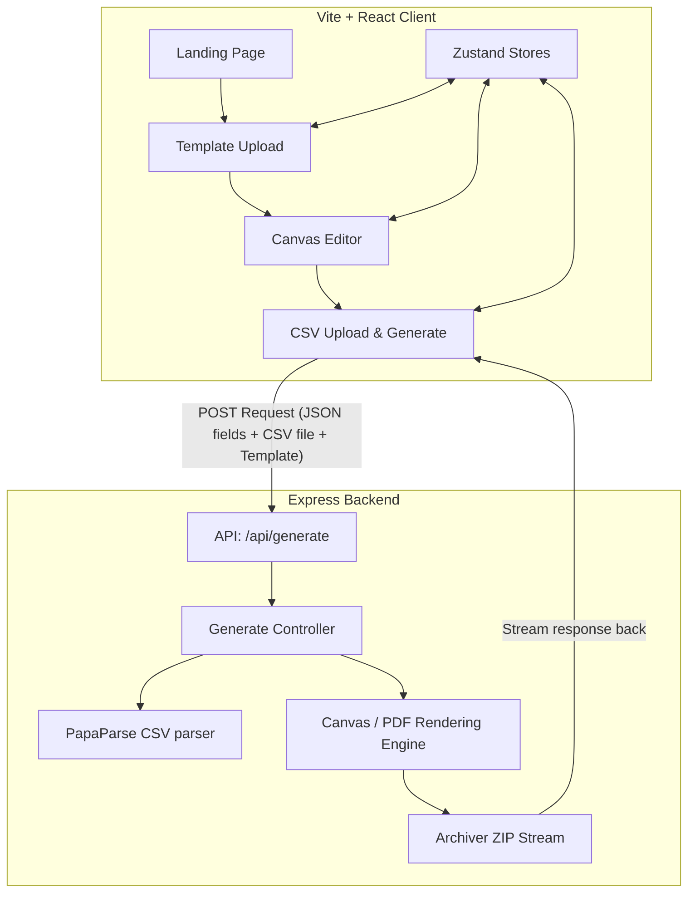
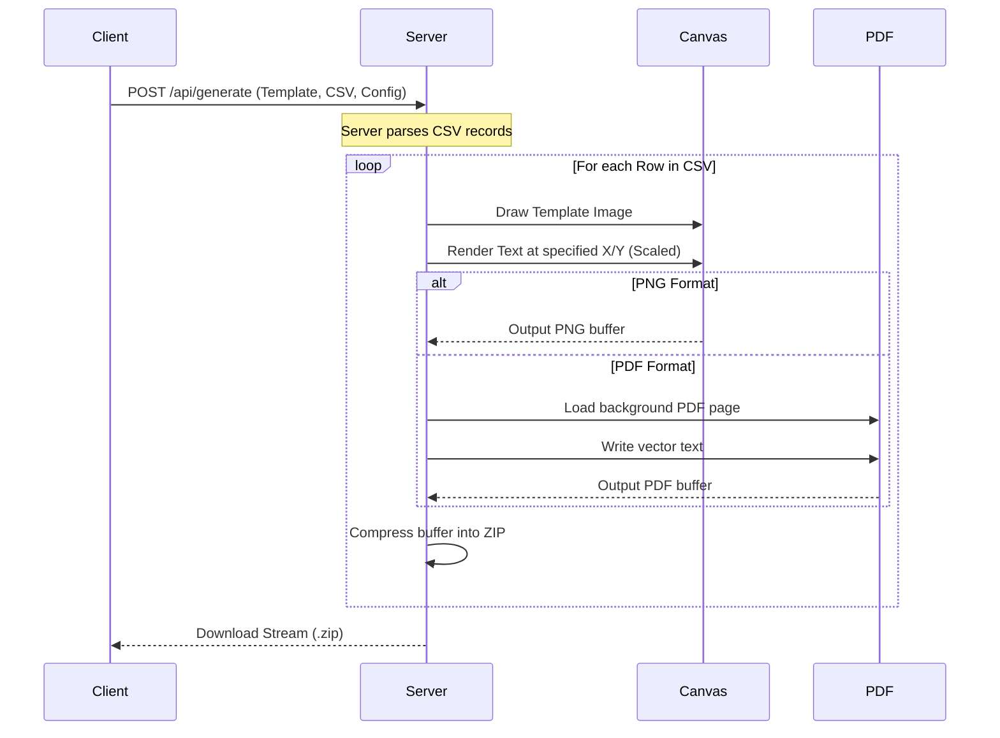

# Valora: Full Project Walkthrough

Welcome to the comprehensive walkthrough of the **Valora (Certificate Generator)** project. This document details the end-to-end architecture, user flows, database/state design, canvas editing setup, and server-side rendering pipeline.

---

## 🏗️ Architecture Overview

Valora is structured as a modern full-stack web application consisting of a React client powered by Fabric.js and a Node.js/Express server performing bulk rendering and ZIP streaming.



---

## 🛠️ Technology Stack

### Client-Side
*   **Framework**: React (Vite-powered)
*   **State Management**: Zustand
*   **Canvas Library**: Fabric.js (v6+)
*   **Styling**: Vanilla CSS (CSS variables, dynamic themes, and glassmorphism layouts)
*   **Routing**: React Router DOM
*   **Animations**: Framer Motion
*   **Notifications**: React Hot Toast

### Server-Side
*   **Runtime**: Node.js & Express
*   **CSV Parsing**: PapaParse
*   **Rendering**: 
    *   `node-canvas` for high-performance PNG rendering
    *   `pdf-lib` for vector PDF rendering
*   **Compression**: `archiver` for streaming ZIP files on-the-fly
*   **Font Registration**: System/custom fonts loading (`canvas.registerFont`)

---

## 📁 Project Directory Structure

```
certificate_generator/
├── client/
│   ├── src/
│   │   ├── components/
│   │   │   ├── editor/          # CanvasEditor, FieldPalette, TextProperties
│   │   │   └── layout/          # Navbar & Steps Indicator
│   │   ├── hooks/
│   │   │   └── useCanvas.js     # Fabric.js Canvas controller logic
│   │   ├── pages/
│   │   │   ├── LandingPage.jsx  # Rich intro & feature showcases
│   │   │   ├── TemplateUploadPage.jsx
│   │   │   ├── EditorPage.jsx
│   │   │   └── CsvUploadPage.jsx
│   │   ├── store/
│   │   │   ├── useEditorStore.js   # Stores active fields, active selection
│   │   │   ├── useTemplateStore.js # Stores current template file & URL
│   │   │   └── useThemeStore.js    # Theme switcher state
│   │   ├── index.css            # Centralized theme tokens, buttons & utils
│   │   └── App.jsx              # Routing & toast setup
├── server/
│   ├── src/
│   │   ├── controllers/         # Generate controllers
│   │   ├── routes/              # Express API endpoints
│   │   ├── services/            # node-canvas and pdf-lib rendering pipeline
│   │   └── utils/               # App constants (Fonts, templates, etc.)
│   └── server.js                # Server entry point
```

---

## 💻 Client-Side Pages & Components

### 1. Landing Page (`LandingPage.jsx`)
*   Provides a sleek landing page with feature cards, a visual step-by-step workflow guide, and responsive animations.
*   Acts as the starting point, leading the user to `/upload`.

### 2. Template Upload Page (`TemplateUploadPage.jsx`)
*   Allows users to drop or select a certificate template image (PNG/JPG).
*   Determines and stores image dimensions to set the canvas size.
*   Navigates to `/editor`.
*   **State Reset**: Automatically resets any stale editor fields before loading a new template.

### 3. Canvas Editor Page (`EditorPage.jsx`)
*   Composes the sidebar controls and the editor canvas.
*   **Field Palette**: Allows adding predefined placeholders (e.g. `{{Name}}`, `{{Date}}`, `{{EventName}}`, `{{CertificateID}}`) or custom labels.
*   **Text Properties Sidebar**: Controls customization properties for the selected field:
    *   Font Family (Inter, Roboto, Playfair Display, Montserrat, etc.)
    *   Font Size, Color, Weight, Style, and Alignment
    *   Letter spacing and Rotation angle
*   **Canvas Container (`CanvasEditor.jsx`)**: Houses the canvas HTML element.

### 4. Fabric.js Canvas Hook (`useCanvas.js`)
Handles low-level Canvas operations and bridges Fabric.js objects to Zustand state:
*   **Scale Factor**: Resizes the visual template background to fit the user's screen while keeping track of the absolute design dimensions.
*   **Field Rendering**: Creates `IText` objects on the canvas using normalized coordinates (0.0 to 1.0) so coordinate maps remain scale-independent.
*   **Events**:
    *   `selection:created`/`selection:updated`: Synchronizes the active object to the Zustand selected state.
    *   `object:modified`: Recalculates normalized positions and scaled font sizes, saving them back to the store.
*   **State Preservation**: Loads pre-existing fields upon canvas initialization, allowing seamless continuation of editing sessions.

---

## ⚙️ Server-Side Rendering Pipeline

When the client triggers generation, it sends a payload containing the template image, field mapping configuration (positions, font families, styles, colors), and the CSV data.



### 1. CSV Processing
The API accepts a multi-part form containing the CSV file. `papaparse` parses the file into row objects containing the dynamic field data (such as names, event details, event IDs).

### 2. Render Engine (`renderEngine.js`)
*   **Font Registration**: Uses `canvas.registerFont` to load TTF/OTF fonts to match standard styles (Inter, Montserrat, Roboto, etc.) requested by the editor.
*   **PNG Engine**: Uses Node-Canvas to create an image context of the original size, draw the template background, and render styled text using coordinate percentages.
*   **PDF Engine**: Leverages `pdf-lib` to embed the background template image into clean vector PDF documents, rendering high-fidelity text fields directly.
*   **Archiver**: Streams files on-the-fly to a ZIP file wrapper, preventing server memory overflow during large batch runs.

---

## 🔁 User Flow & State Life Cycle

Here is the step-by-step user journey, including state management:

```
[Upload Template] ──> Store template dimensions & reset field layout.
        │
        ▼
[Editor Screen]  ──> Place placeholders. Canvas updates Zustand Store with (x, y, style).
        │
        ▼
[Upload CSV]     ──> Match CSV columns with canvas placeholders. Submit details.
        │
        ▼
[Success Screen] ──> Generation finishes, ZIP download starts automatically.
        ├───> [Edit Again] ───> Return to Editor. Fields restored on canvas exactly as left.
        └───> [Back to Home] ──> Reset store, clean memory, return to Landing Page.
```

---

## 💎 Design and UX Enhancements

*   **Glassmorphic Design UI**: Rich modern components with blurred card backdrops, glowing outline states, and deep dark backgrounds (`#09090b`).
*   **Interactive Steps Header**: The Navbar includes a progress bar tracking steps from Upload ➔ Design ➔ Generate.
*   **State Resiliency**: The "Edit Again" function preserves font styles, alignments, rotation angles, colors, and coordinates, allowing continuous iterations without starting from scratch.
